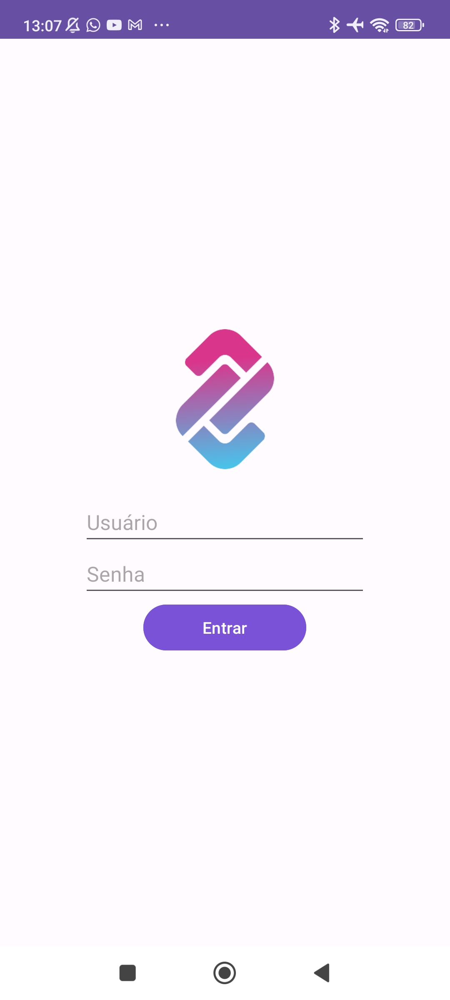
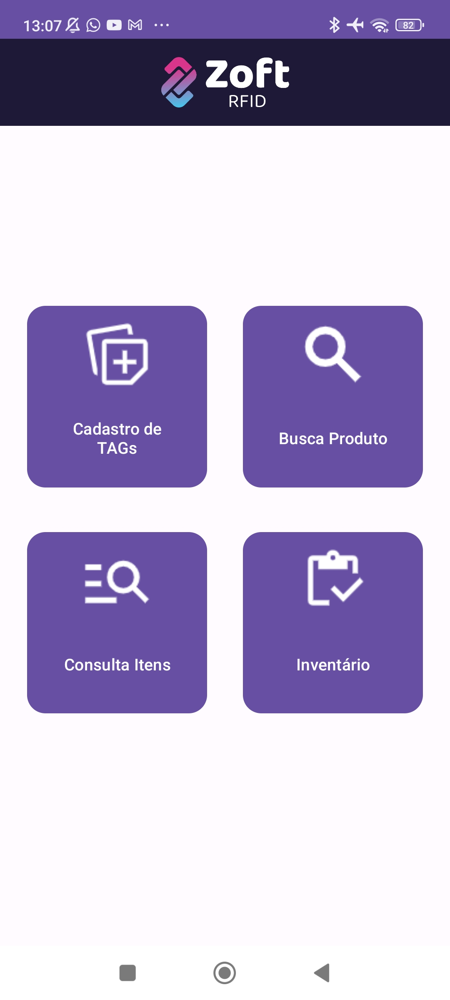
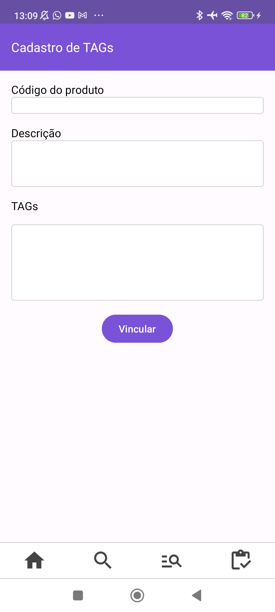

# ZoftRfid

ZoftRfid é um aplicativo Android para gerenciar e ler etiquetas RFID, integrado ao sistema ERP da Zoft. Este projeto foi desenvolvido para facilitar o rastreamento de itens utilizando tecnologia RFID.

## Features

- Leitura de etiquetas RFID.
- Interface amigável e intuitiva.
- Relatórios detalhados de leitura.
- Configurações personalizáveis.

## Screenshots

### Tela de Login




### Tela Inicial




### Tela de cadastro de TAGs




## Instalação

### Pré-requisitos

- Android Studio instalado.
- Git instalado.

### Passos

1. Clone o repositório:
    ```bash
    git clone https://github.com/MichelRodrigues/ZoftRfid.git
    ```
2. Abra o Android Studio e selecione `File` > `Open` e navegue até a pasta do projeto clonado.
3. Sincronize o projeto com Gradle files.

## Como Usar

1. Conecte seu dispositivo Android via USB ou use um emulador.
2. Selecione o dispositivo/emulador no Android Studio.
3. Clique no ícone de 'Run' ou use o atalho `Shift + F10`.

## Contribuição

Contribuições são bem-vindas! Sinta-se à vontade para abrir issues para relatar bugs ou sugerir melhorias, e enviar pull requests.

### Passos para Contribuir

1. Faça um fork do projeto.
2. Crie uma nova branch:
    ```bash
    git checkout -b minha-feature
    ```
3. Faça suas alterações e commit:
    ```bash
    git commit -m 'Adicionar minha feature'
    ```
4. Envie para a branch original:
    ```bash
    git push origin minha-feature
    ```
5. Abra um Pull Request.

## Licença

Este projeto está licenciado sob a Licença MIT - veja o arquivo [LICENSE](LICENSE) para mais detalhes.

## Contato

Michel Rodrigues - [Seu Email](mailto:michel.r.machado@gmail.com)

Projeto Link: [https://github.com/MichelRodrigues/ZoftRfid](https://github.com/MichelRodrigues/ZoftRfid)
